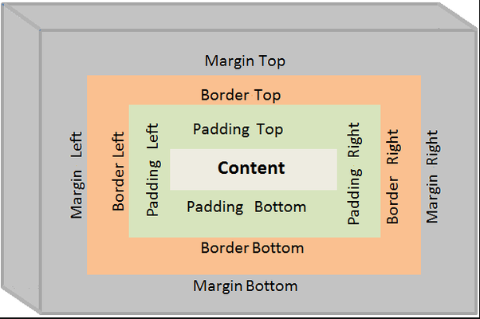

# Zero To Hero CSS
## What is CSS?
* it stands for cascading style sheet
* its used to make web site look better
* they can be used for: 
	* styling
	* layouts & Design
	* Animations
	* Font changes
	* grid systems
	* and many more
* CSS files are saved with the .css extension, and are liked using HTML tags

## what is a CSS selector?
* A CSS selector is the first part of a CSS Rule.
* they ae ways of grabbing and manupilating HTML
* Different selectors have different purposes
* **Element selector**: a way to select all the elements with a given tag name in a document, and apply the same styles to each element with the tag name.
* **class selector** : a way to select all the elements with a given class name in a document, and apply the same styles to each element with the class name.
* **ID selector** : a way to select all the elements with a given ID in a document, and apply the same styles to each element with same id.

## Classes & IDs in HTML
### class selecor
* we use a period character(.) followed by the name of the class
* most browsers support this
### id
* we use a harsh tag(#) followed by the id name


* we use a class when we need to use the same selector more than once within a page
* ID is specific to a single element, classes can be assigned to multiple elements on a page or throughout the website. They are not unique.

* selectors have different powers:
	* Below are the order of specificity rule which has precedence respectively: 1) Inline style: Inline style has highest priority among all.
	* Id Selector: It has second highest priority.
	* Classes, pseudo-classes and attributes: These selectors has lowest priority.
## pseudoselectors
* used commonly when something is done on the website(interactivity)
* after stating the selector we use a colon followed by the pseudoselector name
## advanced selectors
* when we say 'h2 + a' we mean that ever h2 header followed by a link will have certain properties that will be specified, where h2 is a parent element
### 1)Adjucent sibling selector
* It selects all the elements that are adjacent siblings of specified elements. It selects the second element if it immediately follows the first element. 
* for example:

```
h4+ul{
    border: 4px solid red;
}

```

* this select ul tags that immedietly follow h4 tag
### 2)Attribute Selector
*  It selects a particular type of inputs.
#### syntax

```
input[type="checkbox"]{
    background:orange;
}
```

####example

```
<html>
   <head>
      <title>Attribute</title>
      <style type="text/css">
         a[href="http://www.google.com"]{
         background:yellow;
         }
      </style>
   </head>
   <body>
      <a href="https://www.geeksforgeeks.org">geeksforgeeks.com</a><br>
      <a href="http://www.google.com" target="_blank">google.com</a><br>
      <a href="http://www.wikipedia.org" target="_top">wikipedia.org</a>
   </body>
</html>
```

### 3)nth-of-type Selector
* selects an element from its position and types. 

```
div:nth-of-type(5){
    background:purple;
}
```

### 4)Direct Child Selector
* It selects any element matching the second element that is a direct child of an element matching the first element.
*  The element matched by the second selector must be the immediate children of the elements matched by the first selector. 
#### syntax

```
p > div {
	background-color: DodgerBlue;
}
```
### 5)General Sibling Selector
*  It selects only the first element if it follows the first element and both children are of the same parent element
* It is not necessary that the second element immediately follows the first element.
#### Syntax:
* Changes to the span element content which follows paragraph tag and both have same parent tag. 

```
p ~ span {
	color: red;
}
```
### 6)Element Selector
* It selects the text enclosed inside the mentioned element. 

#### Syntax:

```
div {
	background: green;
}
```
### 7)Star Selector
* The changes made will be made to whole page. 

#### Syntax:

```
* {
	background: purple;
}
```
### 9)Descendant Selector
* It makes changes only to those elements which are inside the other element. 
#### Syntax: 
* Select all the anchor tags which are inside ‘li’ element which are inside ‘ul’ element.

```
ul li a {
	color: red;
}
```
## Properties
### images
* By default the value for the background-repeat property is no-repeat.

### grandients
* there 2 types of grandients:
	* radial - are circular
	* linear - from left to right, top to bottom or diagonally
* linear gradient is a background property value
* an example of linear grandient is:

```
background: linear-grandient(to right, red, blue);

```
we can also add an rgba() color value

```
background: linear-grandient(to right, red, blue) rgba(56, 100, 255, 0.3);

```
* an example of radial gradient is:
```
background: radial-gradient(red, blue);

```
* we can add the color propotions like this:
```
background: radial-gradient(red 20%, blue 40%, green 55%);

```
## Types of Units
### absolute and relative units
* unlike absolute units relative units depend on something(parent element)
* relative units is preffered when it comes to a responsive design. examples:
	* percentage
	* em
	* view-width
	* view-height
* (research on units)

## Text-manipulation
* they are not dependant on the font
* involves text size, underlining, color, uppercase etc
## Font-manipulation
* involves things like bolding
## font families
* there three major font families commonly used:
	* san-serif
	* serif
	* monospace
## external fonts

* we copy the link to the fonts and paste it above the link stylesheet
* will then take select the font we want to use in our CSS file
* its advisable to add a default font incase the extrernal one fails

## CSS: The Box Model
* its a box that raps around HTML elements

### Padding
* its space between content and the border
* it gives more rom around the content
### margin
* its space between border and other content
### border
* the basic syntax is :
```
border: size style color;

```
## Flexbox
* its split into 2,.. the continer and flex items
* the container is the parent element;in which the display type is active(normally inform of div)
* flex items are the child making up the context of the box.
* we can create a flex container this way
```
<div class="flex-container">
  <div>1</div>
  <div>2</div>
  <div>3</div>
</div>
```
* the container becomes flexible after setting display property to flex eg..
```
.flex-container {
  display: flex;
}
```
### flex container properties
#### flex-direction
* its the direction you want to stack items
* eg the column value stacks items vertically
```
.flex-container {
  display: flex;
  flex-direction: column;
}
```
#### flex-wrap property
* it specifies whether the flex items should be wrap or not
```
.flex-container {
  display: flex;
  flex-wrap: wrap-reverse;
}
```
#### flex-flow property
* its a shorthand property for setting both flex-direction and flex-wrap properties eg
```
.flex-container {
  display: flex;
  flex-flow: row wrap;
}
```
#### justify-content property
* used to align flex items.
```
.flex-container {
  display: flex;
  justify-content: center;
}
```
* the center value aligns items to the center of the parent element(container)
* The flex-start value aligns the flex items at the beginning of the container
* The space-around value displays the flex items with space before, between, and after the lines
#### align-items property
* used to align flex items
```
.flex-container {
  display: flex;
  height: 200px;
  align-items: center;
}
```
#### align-content property
* used to align the flex lines
#### Perfect Centering
* to do this we set the justify-content and align-items properties to center, and the flex item will be perfectly centered
### CSS Flex Items


