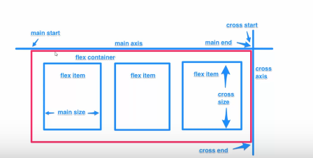

# Flexbox
* it's an and clean way to arrange items in a container
* it is responsive and mobile friendly
* it makes positioning of child element much easier
* its margins don't collapse with its contents
* order of margin can be easily changed without touching HTML
```
NB: flex is build for small scale layouts while grid is for large scale

```

